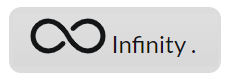
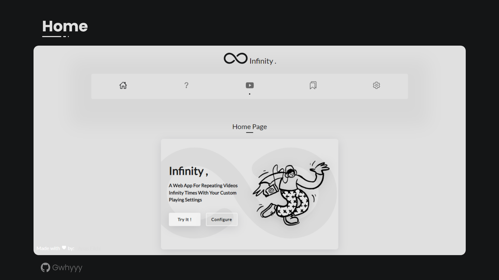
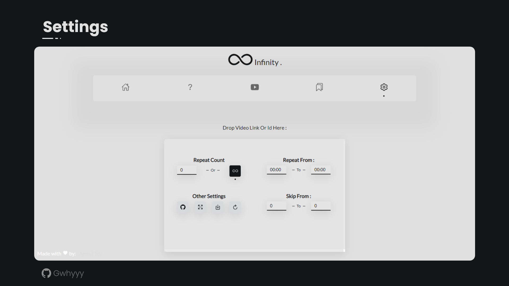

# Infinite Youtube Repeater
A Featured Web App For Repeating Videos With Infinity Times Loop With Your Custom Playing Settings 
 
<a href="">view demo here</a>

## Features
 - Quick start buttons
 - Read video from different youtube links( youtube.com, youtu.be, m.youtube.com ), video id ( Ex: 7YZCUpnaTfg , don't check this video id hahaha )
 - Paste from keyboard button
 - Auto play video by just pasting option
 - Input validator for non valid links
 - Possibility to add to favorites (which can be shown even if you reload the page without data loss)
 - Possibility to choose repeat count or infinity repeat option
 - Possibility to choose play range in video option (part of video that will be only played)
 - possibility to choose skip range in the video option (part of video that will be skipped)
 - Fullscreen option
 - Export your favorites to json file option
 - Reset all settings option
 - The last video played will be remembered for the next use of web app 
 - Play directly in player from favorites by just a simple click
 - faq
 <r> 
 
## User experience Friendly Features
- simple & clean design
- easy paste link
- save added favorites to local storage, so they will never be lost, until they will be delted manually or if the browser is deleted.
- save the last played video in the player, so even the user will close and open the web app, he will find the video that he was playing from last use (I made this feature and i love it, cause i don't wanna every time go and pick video from youtube.com)
- informing the user if the link or id pasted is valid or not
- quick buttons in home section
<r> 

## Why I Made This ?
Okay, I'm confeesing, the real reason why I made this is for the user Experience and the design, I was using other youtube repeaters service in some website, and the commun thing between all of them was:
- I should do all things with my own like copy/paste links, click play buttons, click more buttons for set settings...)
- no save to bookmarks option without authenticate to website
- no skip/play only parts of video and no repeat count
- like I've mentionned, no auto save for last played video
- the non-simple design with a lot of colors and unnecessary stuff
- the ads ( isn't youtube ads enough )
- no export json file
<r> 
# To-do
 - refactor the code and comment it
 - search for errors
 - add night mode
 - add color themes
 - add paste on page load functionnality with it's setting
 - possibility to delete from the bookmarks
 - possibility to delete all favorites at once
   
 
## Usage

Clone the project to your environment and run index.html file, that's it.
## Contribute
if you have any suggestions, edit on the Readme (because I won't read it), edit in the code, features you can help with, just do it ( if you want of course ), feel free to use it
